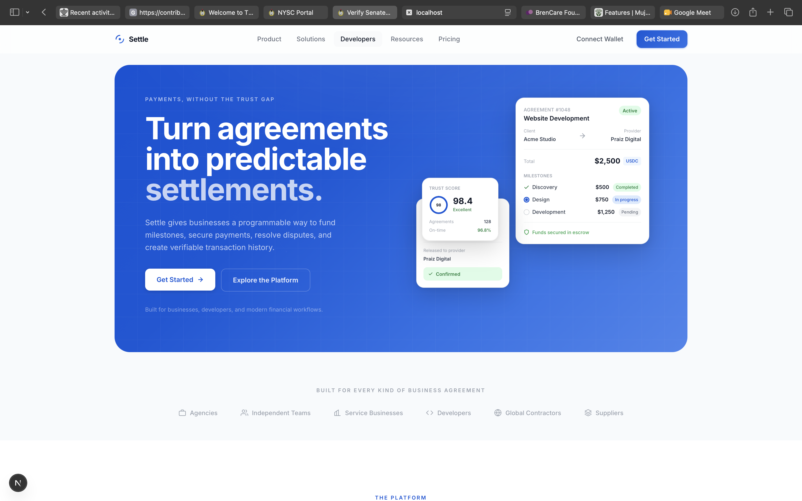
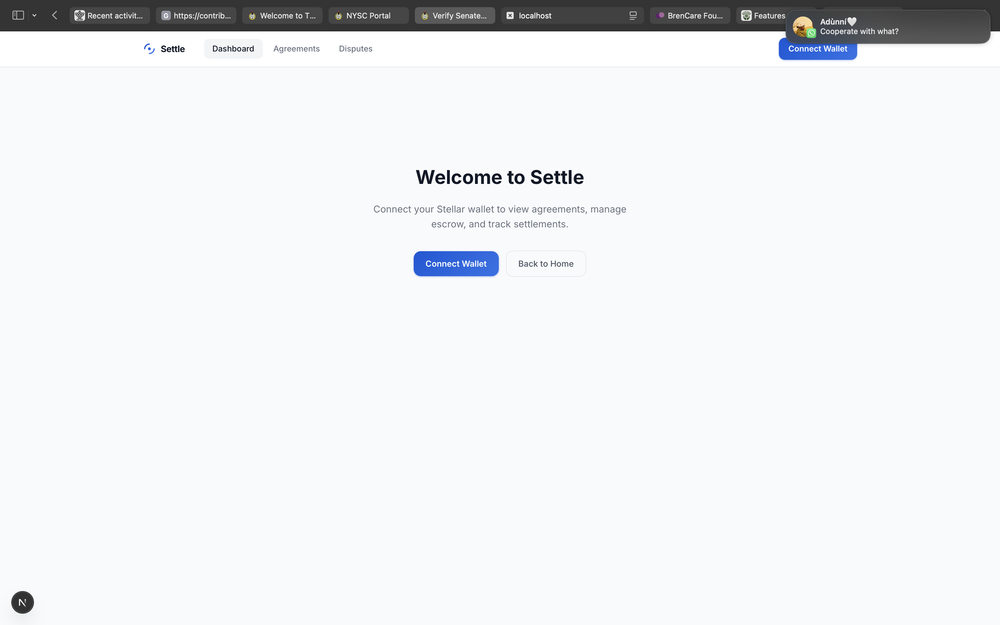
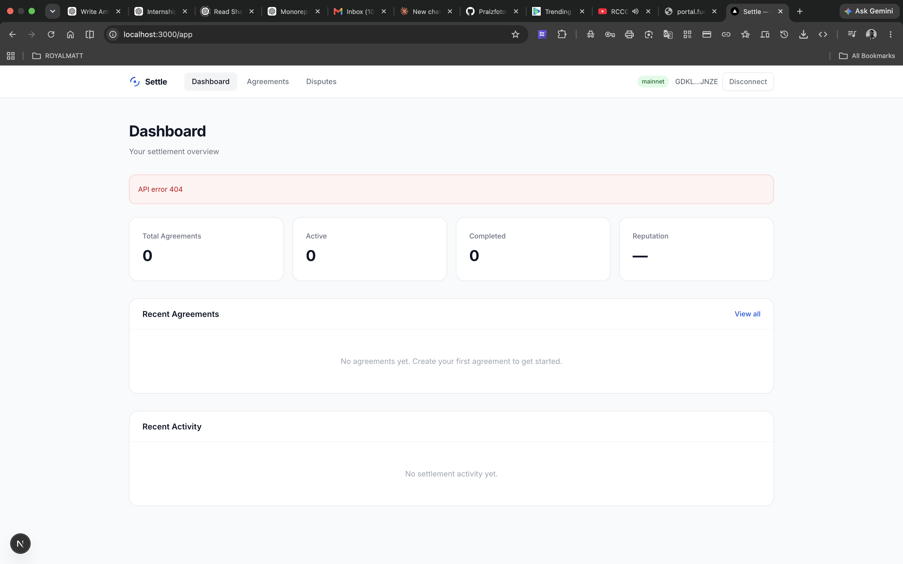
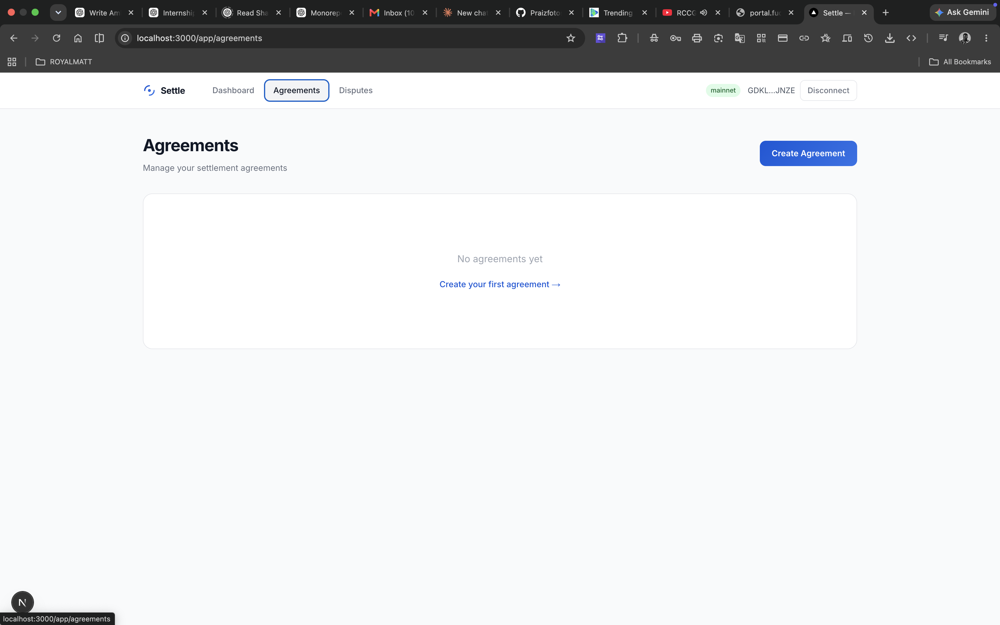

# Settle

**Programmable Settlement Protocol on Stellar Soroban**

Settle is a programmable settlement protocol built natively on Stellar and Soroban smart contracts. It enables parties to create agreements, fund escrow, manage milestones, and complete settlements — all enforced on-chain through wallet-signed Soroban transactions.

## Current Status

**Stellar Testnet — verified end-to-end.**

The core agreement and milestone lifecycle has been verified on Stellar Testnet with real wallet-signed transactions. All contract logic executes on-chain via Soroban.

### Verified Testnet Deployment

**Contract**: `CBLYA2COXPBCFMCJUSB74B6JEVOMHIHQE7YZYV3I42BXCLZOYOEHJTE7`
**Test Token (SEP-41)**: `CCQPQBKJ3D6WTU3CFINUZ5XLQFMMVXO6NJTWTSQJSMSCGTYLOEO4K7EZ`

| Step | Tx Hash |
|------|---------|
| Initialize | [`a936be09...`](https://stellar.expert/explorer/testnet/tx/a936be09f17274ec423e5bd5e9add637e688785828e78d8cf9d27f9ac65337c8) |
| Create Agreement | [`3e4264ae...`](https://stellar.expert/explorer/testnet/tx/3e4264ae56c2cc9e711319406c704f010d8702ecebb1a5ed4586499b5398d6db) |
| Fund Agreement | [`db7954cf...`](https://stellar.expert/explorer/testnet/tx/db7954cf8e5526e6d176495fab1ed017526de27ee0708797e394bd720dd33a7c) |
| Activate Agreement | [`cc020bda...`](https://stellar.expert/explorer/testnet/tx/cc020bdad5ffd921072075327a0ffa0754abda9e48bde4ebfa7373395ce27dd7) |
| Create Milestone | [`ec29091c...`](https://stellar.expert/explorer/testnet/tx/ec29091c31dfc44d86b85781a910bd77dbbdb5edd4b0c16c789d1cff3c6e655a) |
| Submit Milestone | [`e71c424e...`](https://stellar.expert/explorer/testnet/tx/e71c424eb9349311f2915c41daaf09a40cbdbee90b07e86213a4c54955242a28) |
| Approve Milestone | [`b9c1a436...`](https://stellar.expert/explorer/testnet/tx/b9c1a4367da897fa2f4a7053ab6876063fe3b1cab504d813d427e59176f658d2) |
| Complete Agreement | [`8c03056a...`](https://stellar.expert/explorer/testnet/tx/8c03056ae8583832834e263e5333cfff4599a1b8c7ffba91374d458b33e1e19d) |

### What is verified

- Soroban smart contracts compile to WASM and deploy to Testnet
- 17/17 contract unit tests pass
- Full agreement lifecycle: create → fund → activate → complete
- Full milestone lifecycle: create → submit → approve
- Frontend builds Soroban transaction XDR
- Freighter wallet signs transactions
- Transactions submit and confirm on Testnet
- Real transaction hashes viewable on Stellar Expert

## Demo

### Landing Page



### Connect Wallet



### Dashboard



### Create New Agreement



### What is in development

- Backend indexer: architecture complete, Stellar RPC client stubbed
- Backend API: schema and domain models real, service layer stubbed
- Escrow and dispute frontend flows
- Real-time event indexing from contract to PostgreSQL

## Architecture

```
User
 ↓
Next.js Frontend (apps/web)
 ↓
@stellar/stellar-sdk (transaction building)
 ↓
Freddighter Wallet (transaction signing)
 ↓
Stellar Testnet (Soroban contract execution)
 ↓
Contract Events (AgreementCreated, MilestoneApproved, etc.)
 ↓
Backend Indexer (backend/indexer) — architecture complete, RPC client stubbed
 ↓
PostgreSQL (read model)
 ↓
REST API (backend/api) — schema real, service layer stubbed
```

The protocol is Stellar-native: all state transitions happen in Soroban contracts. The frontend builds and signs transactions directly. The backend indexes contract events for efficient queries (architecture complete, pending Stellar RPC integration).

## Smart Contracts

Located in `contracts/stellar-contract/`. Built with `soroban-sdk 21.x`.

### SettleContract (main entry point)

- `initialize` — Set contract admin
- `create_agreement` — Create a new agreement between parties
- `fund_agreement` — Fund an agreement (creator deposits)
- `activate_agreement` — Activate a fully funded agreement
- `complete_agreement` — Mark agreement as completed (counterparty)
- `cancel_agreement` — Cancel an agreement (creator)
- `create_milestone` — Create a milestone for an agreement
- `submit_milestone` — Submit milestone with evidence (counterparty)
- `approve_milestone` — Approve a submitted milestone (creator)
- `reject_milestone` — Reject a milestone with reason
- `release_milestone_payment` — Release payment for approved milestone
- `open_dispute` — Open a dispute for an agreement
- `submit_evidence` — Submit evidence to a dispute
- `resolve_dispute` — Resolve a dispute (arbitrator)
- `close_dispute` — Close a dispute

### Supporting modules

- `AgreementContract` — Agreement lifecycle logic
- `EscrowContract` — Escrow fund management
- `MilestoneContract` — Milestone tracking and validation
- `DisputeContract` — Dispute resolution process
- `Authorization` — Auth checks for all operations
- `Validator` — Input validation and state transition rules
- `EventBuilder` — Structured event emission
- `Storage` — Soroban persistent storage operations

## Running Locally

### Prerequisites

- Rust with `wasm32v1-none` target
- Node.js 18+
- [Stellar CLI](https://developers.stellar.org/docs/tools/sdks/cli)
- [Freighter](https://freighter.app/) browser extension

### Build the contract

```bash
stellar contract build --out-dir contracts/stellar-contract/target/wasm
```

### Run tests

```bash
cargo test --package stellar-contract
```

### Deploy to Testnet

```bash
# Generate a wallet
stellar keys generate --network testnet my-wallet

# Fund via Friendbot
curl "https://friendbot.stellar.org?addr=$(stellar keys address my-wallet)"

# Deploy
stellar contract deploy \
  --wasm contracts/stellar-contract/target/wasm/stellar_contract.wasm \
  --source my-wallet --network testnet

# Initialize
stellar contract invoke --id <CONTRACT_ID> --source my-wallet --network testnet \
  -- initialize --admin my-wallet
```

### Frontend

```bash
# Set the contract address in apps/web/.env
NEXT_PUBLIC_STELLAR_CONTRACT_ADDRESS=<your-contract-id>

# Start dev server
cd apps/web
npm run dev
```

Open [http://localhost:3000](http://localhost:3000), connect Freighter, and create an agreement.

## Repository Structure

```
settle/
├── contracts/stellar-contract/    # Soroban smart contracts (Rust)
│   ├── src/lib.rs                 # Main SettleContract + module wiring
│   ├── src/agreement.rs           # Agreement lifecycle logic
│   ├── src/escrow.rs              # Escrow fund management
│   ├── src/milestone.rs           # Milestone tracking
│   ├── src/dispute.rs             # Dispute resolution
│   ├── src/storage.rs             # Soroban persistent storage
│   ├── src/events.rs              # Structured event emission
│   ├── src/validation.rs          # Input validation + state transitions
│   ├── src/errors.rs              # Contract error definitions
│   ├── src/types.rs               # Domain types (Agreement, Milestone, etc.)
│   └── src/*_tests.rs             # 17 unit tests
├── backend/                       # Rust API + indexer (in development)
│   ├── src/api/                   # REST API endpoints
│   ├── src/indexer/               # Event polling, decoding, processing
│   ├── src/stellar/               # Stellar RPC client (stubbed)
│   └── src/services/              # Business logic layer (stubbed)
├── packages/
│   ├── sdk/                       # @settle/sdk — Soroban transaction builder
│   ├── types/                     # @settle/types — shared type definitions
│   └── stellar/                   # @settle/stellar — network utilities
├── apps/
│   └── web/                       # Next.js frontend + Freighter integration
└── docs/                          # Architecture documentation
```

## Tech Stack

| Layer | Technology |
|-------|-----------|
| Smart contracts | Soroban (Rust) on Stellar |
| Contract build | `stellar contract build` (wasm32v1-none) |
| SDK | TypeScript, `@stellar/stellar-sdk` |
| Frontend | Next.js, React, Tailwind CSS |
| Wallet | Freighter (Stellar browser extension) |
| Backend | Rust, Axum, SQLx, PostgreSQL (in development) |

## Environment Variables

### Frontend (`apps/web/.env`)

| Variable | Description | Default |
|----------|-------------|---------|
| `NEXT_PUBLIC_STELLAR_NETWORK` | `testnet` or `mainnet` | `testnet` |
| `NEXT_PUBLIC_STELLAR_RPC_URL` | Soroban RPC endpoint | `https://soroban-testnet.stellar.org` |
| `NEXT_PUBLIC_STELLAR_CONTRACT_ADDRESS` | Deployed contract address | (required) |
| `NEXT_PUBLIC_STELLAR_NETWORK_PASSPHRASE` | Network passphrase | `Test SDF Network ; September 2015` |

## Contributing

See [CONTRIBUTING.md](CONTRIBUTING.md) for development guidelines.

## License

MIT License — see [LICENSE](LICENSE) for details.
